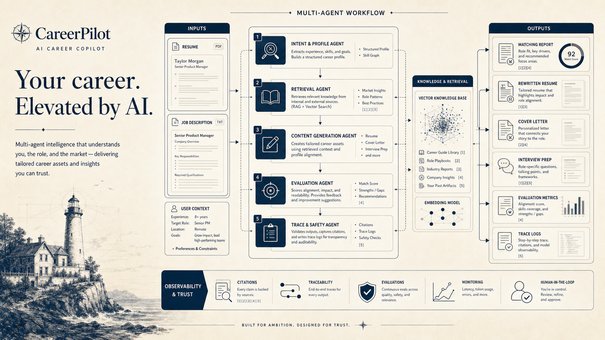

# CareerPilot



CareerPilot is a multi-agent AI career application assistant for resume ingestion, JD analysis, matching, rewriting, cover letter generation, interview preparation, and agent trace observability.

## Monorepo layout

- `apps/api`: FastAPI backend
- `apps/worker`: Celery worker launcher
- `apps/web`: React frontend
- `packages/shared`: shared TypeScript contracts
- `infra/docker`: local container orchestration

## Quickstart

### 1. Install dependencies

```bash
uv sync --dev
npm install
```

### 2. Configure environment

Copy `.env.example` into your real local environment source of choice before running the API or worker.

Important values:

- `CAREERPILOT_DATABASE_URL`: database connection string
- `CAREERPILOT_REDIS_URL`: Redis broker/backend for Celery
- `CAREERPILOT_ENVIRONMENT`: runtime mode, affects cookie security and dev-only CORS regex behavior
- `CAREERPILOT_JWT_SECRET`: required secret, replace the placeholder with a real value
- `CAREERPILOT_AUTH_COOKIE_NAME`: auth session cookie name
- `CAREERPILOT_AUTH_CSRF_COOKIE_NAME`: readable CSRF cookie name paired with the session cookie
- `CAREERPILOT_AUTH_CSRF_HEADER_NAME`: required header name for cookie-authenticated write requests
- `CAREERPILOT_AUTH_COOKIE_SAMESITE`: cookie `SameSite` policy
- `CAREERPILOT_AUTH_COOKIE_SECURE`: set `true` outside local development
- `CAREERPILOT_DEEPSEEK_API_KEY`: optional, enables live provider calls
- `CAREERPILOT_CORS_ORIGINS`: explicit allowed origins for browser clients
- `CAREERPILOT_CORS_ORIGIN_REGEX`: localhost-oriented fallback regex for development
- `CAREERPILOT_CELERY_TASK_ALWAYS_EAGER`: `true` for inline test/dev execution, `false` for real async mode
- `VITE_API_BASE_URL`: frontend API target
- `VITE_CSRF_COOKIE_NAME`: must match `CAREERPILOT_AUTH_CSRF_COOKIE_NAME` if you override it
- `VITE_CSRF_HEADER_NAME`: must match `CAREERPILOT_AUTH_CSRF_HEADER_NAME` if you override it

### 3. Run the backend locally

```bash
uv run alembic upgrade head
uv run uvicorn careerpilot.api.main:app --reload
```

Swagger is available at `http://localhost:8000/docs` and OpenAPI JSON at
`http://localhost:8000/openapi.json`.

### 4. Run the frontend locally

```bash
npm run web:dev
```

## Verification commands

Backend:

```bash
uv run pytest tests -q
uv run ruff check apps/api/src tests
```

Frontend:

```bash
npm run web:test
npm run web:build
npm run e2e:smoke
```

`npm run e2e:smoke` starts a temporary API, a Vite dev server, uploads a generated PDF resume,
creates an application, runs the workflow, and verifies matching, generated outputs, and trace
pages through a real browser session.

## Docker Compose async demo path

Compose now provisions:

- Postgres 16 with `pgvector`
- Redis 7
- a one-shot `migrate` service
- the FastAPI service
- the Celery worker

Bring up the data services first, then run migrations, then start the long-lived app services:

```bash
docker compose -f infra/docker/docker-compose.yml up -d db redis
docker compose -f infra/docker/docker-compose.yml run --rm migrate
docker compose -f infra/docker/docker-compose.yml up api worker
```

This path assumes `CAREERPILOT_CELERY_TASK_ALWAYS_EAGER=false`, which is now the default in
`.env.example` so the API and worker stay aligned with real async execution.

Startup order matters:

1. Postgres and Redis must be healthy.
2. Alembic migrations must run before the API or worker depend on new schema.
3. The API can then accept requests and queue runs.
4. The worker consumes queued runs from Redis.

## Deployment notes

- Keep `CAREERPILOT_JWT_SECRET` out of source control and rotate it per environment.
- The frontend now uses `HttpOnly` cookie-backed auth plus double-submit CSRF protection; do not revert to localStorage tokens in deployed environments.
- Replace permissive/local CORS values with your real frontend origin list before deployment.
- Keep Swagger/OpenAPI exposed only where your deployment policy allows interactive docs.
- Vector storage is intended to live in Postgres via pgvector; CI stays on SQLite for lightweight,
  deterministic verification.

## Current constraints

The repository commands and CI path are still validated primarily against SQLite. If your branch has
not yet added a Postgres driver such as `psycopg`, the Compose topology is ready for Phase 4 but the
Python dependency set still needs that driver before the API can talk to Postgres outside SQLite-based
test flows.

Set `CAREERPILOT_DEEPSEEK_API_KEY` to enable live DeepSeek-backed generation; otherwise the backend
falls back to deterministic local generation for development and tests.
